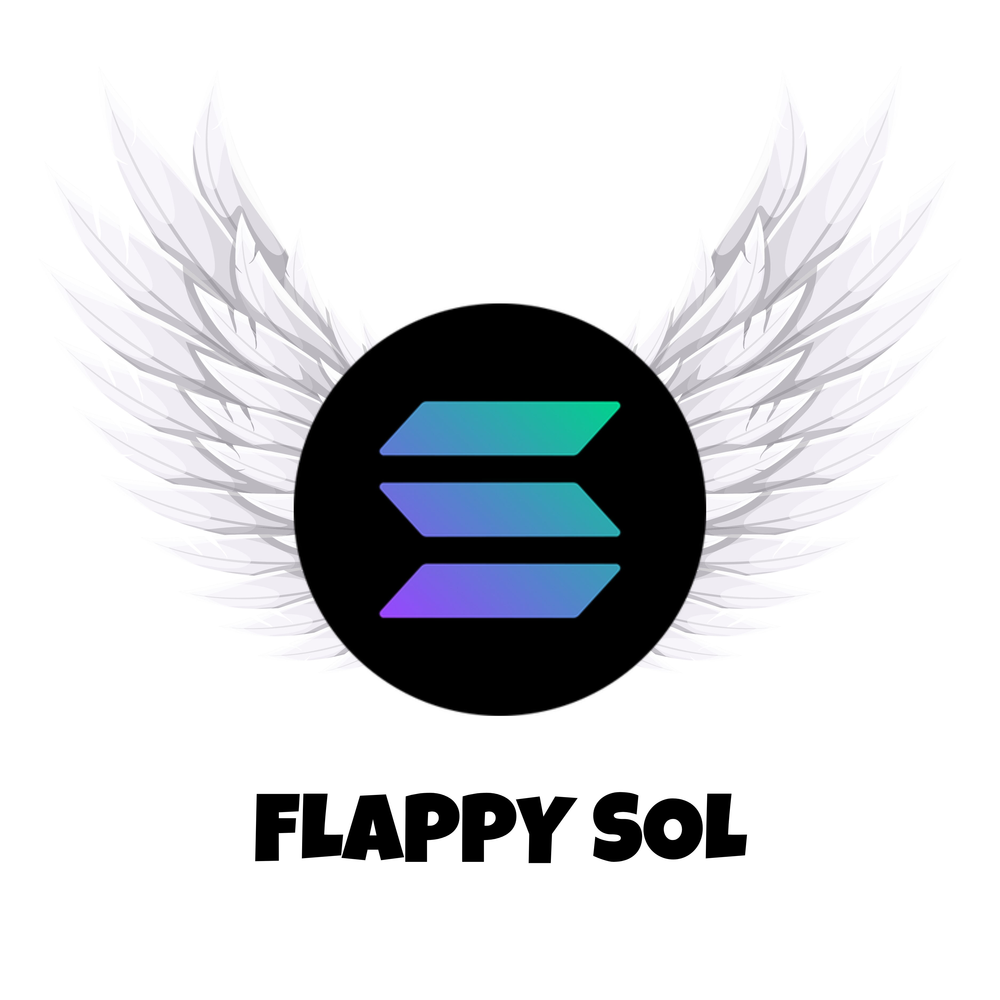

# 🎮 Flappy Sol

A modern take on the classic Flappy Bird game, featuring the Solana cryptocurrency theme. Navigate through pipes and collect special bonuses while enjoying smooth gameplay and beautiful visual effects.

## 🚀 Features

- **Smooth Controls**: Jump with Space or Click
- **Progressive Difficulty**: Game speed increases with score
- **Special Pipes**:
  - Green Pipes (5% chance): +3 points
  - Rare Yellow Pipes (0.5% chance): +10 points
- **Visual Effects**:
  - Particle explosions on special pipe collection
  - Score popup animations
  - Toggleable shadow trail effect
- **Audio Features**:
  - Sound effects with volume control
  - Quick mute toggle
- **Dynamic Gameplay**:
  - Moving pipes (20% chance)
  - Stationary start for easy beginning
- **Responsive Design**: Works on various screen sizes

## 🎯 How to Play

1. Press Space or Click to make the Solana coin jump
2. Navigate through the pipes
3. Collect special pipes for bonus points
4. Avoid hitting pipes or the ground
5. Try to achieve the highest score possible

## 🛠️ Controls

- **Space/Click**: Jump
- **Volume Slider**: Adjust sound volume
- **Mute Button**: Toggle sound on/off
- **Shadow Button**: Toggle shadow trail effect

## 🎨 Visual Features

- Purple gradient background
- Solana coin character
- Special pipe effects:
  - Green pipes with particle explosions
  - Rare yellow pipes with enhanced effects
- Dynamic shadow trail system
- Smooth animations and transitions

## 🎵 Audio Features

- Score collection sound effects
- Game over sound
- Adjustable volume control
- Quick mute functionality

## 🏆 Scoring System

- Normal pipes: +1 point
- Green pipes: +3 points
- Yellow pipes: +10 points

## 🖥️ Technical Details

- Built with HTML5 Canvas
- JavaScript game engine
- Responsive design
- Optimized performance
- Loading screen with progress bar

## 👥 Credits

Created by Santoscapital

Discord: Santoscapital

## 📝 License

This project is open source and available for personal and educational use.

## 🎮 Try It Out

Play the game by opening `index.html` in your web browser. No installation required!

---

Enjoy the game and happy flapping! 🚀 